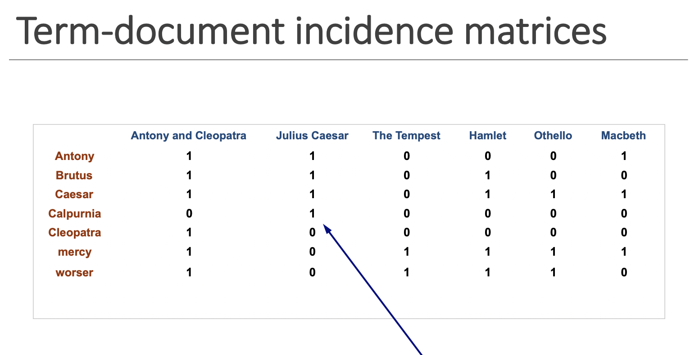
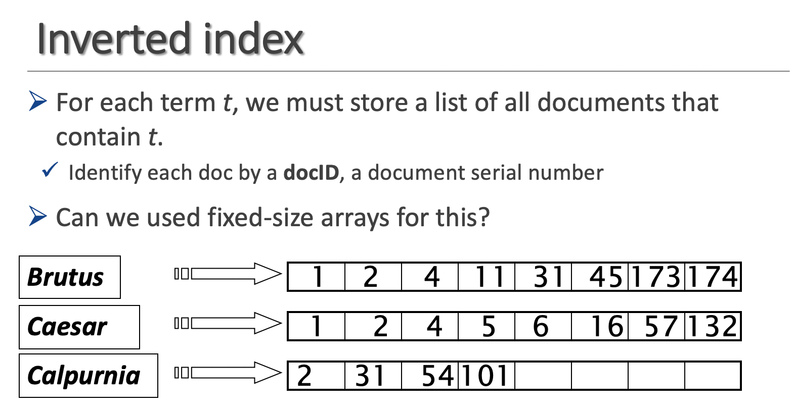

# Text-search-engine
This is efficient text-search engine using inverted-indexing, implemented in C. When the code is run, bootstrapping is done, storing storing information in inverted index.Searching is done through boolean querying.

## Why inverted indexing?

### term-document matrix

One naive way to store words in docs are to make term-doc matrix. However this is very inefficient because matrix is too sparse. You cannot deal with it when there's big number of docs and distinct terms.
ex) N = 1million docs, M = 500k distinct terms  result in 1million X 500k matrix which is half trillion

### inverted index

Inverted indexing only keeps 1's in the matrix, therefore is memory efficient and has much faster querying speed.

#### How to compile

There are two c files, main.c and util.c
Compile to files using gcc main.c util.c -o mininet

#### How to execute

./mininet [absolute filepath]

#### How to search

mininet> search [word]

#### Output

[file name]: line #[linenum]

Remark: only works on text files!
